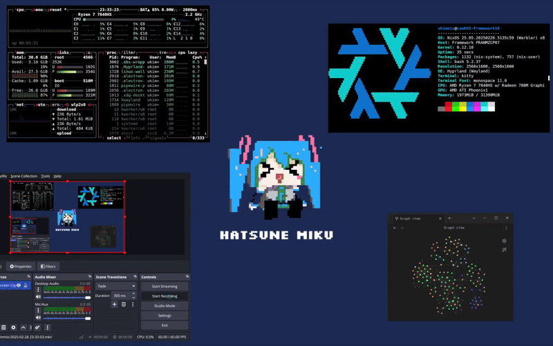

# LeekOS
> [!WARNING] 
    This is repo is no longer maintained. 

> [!IMPORTANT]
    The contents of this repository may NOT be used for AI or anything else that are equivalent

Hello! This is my custom NixOS config! 

## Migrating back to Arch Linux!

I absolutely adore NixOS! It’s an incredible way to build and manage a Linux system. Over the past year, I’ve been running NixOS, and it’s been a fantastic learning experience. The declarative approach to package management is nothing short of brilliant, and there have been countless moments where I’ve thought, “This is amazing—why isn’t this the standard on other Linux distros?” But, if I’m being honest, there have been even more moments where I’ve found myself asking, “Why do I need to jump through so many hoops to get this working?” 

One of the biggest pain points for me has been NixOS’s lack of FHS (Filesystem Hierarchy Standard) compliance. While this design choice is part of what makes NixOS so unique and powerful, it often means extra effort to get certain applications—especially development tools—running smoothly. As someone who isn’t a Nix wizard, this often translates to spending more time than I’d like on configuration and troubleshooting. The documentation for NixOS is decent, but in my experience, it doesn’t quite measure up to the clarity and comprehensiveness of Arch Linux’s wiki. Some might argue otherwise, but for me, Arch’s documentation has always been a gold standard.

After much deliberation, I’ve decided to return to Arch Linux. I’ll definitely miss the declarative package management that NixOS offers—the benefits are undeniable, and for many, it’s a game-changer. However, for my specific use case, the trade-offs just don’t align with my workflow. Arch’s simplicity, flexibility, and the vast resources available in its community feel like a better fit for me right now.

This repo will be archived once I have published my dotfiles :)

## Artwork Removal Request
If you see your artwork/media in this repository and want it removed. Please send me a message at oliver@kym-kim.com

